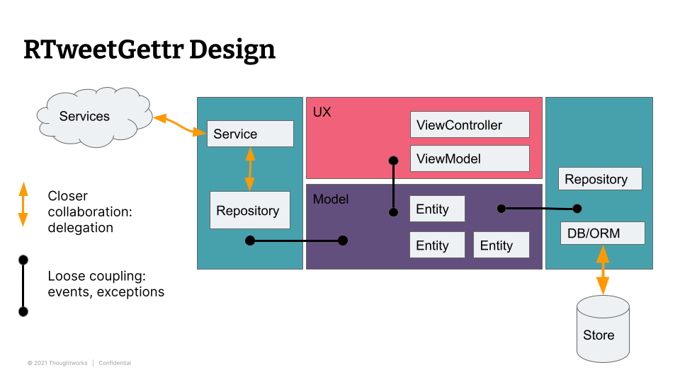

# RTweetGettr

App to demonstrate systems code in React

## Pre-req

* Install the [React Native dev environment](https://reactnative.dev/docs/environment-setup)

(Not Expo - use the full _React Native CLI Quickstart_ and then iOS & Android guide)

## Setup

* Create iOS and Android build environments
* Run via package.json

```
npm start
npm android
```

## Twitter API Keys

To get this to work you'll need Twitter API keys. Go to the [Twitter developer dashboard](https://developer.twitter.com/en/portal/dashboard) to generate some.

Try these out by setting the values in a file `.env` in the root of where this project is checked out, like so:

```bash
BEARER_TOKEN=XXXXXXXXXXXXX
```

Then run `./curl.sh` to try some Twitter API calls. The package.json also has a script to run that.

Where there `XXXX` is something like `AAAA...` - the actual Twitter API bearer token. 

## Architecture

The idea of this app is to implement a REST app that is not a "naive implementation".  See [this 
great video](https://www.youtube.com/watch?v=xHXn3Kg2IQE&t=457s) (even tho' its from 2010) by Android team members talking about "in memory" REST apps.

It also demonstrates:

* Loose coupling
* Use of events
* Using plain singletons instead of Redux
* Repository pattern
* Avoiding React code outside of the UX



* Uses `react-native-navigation` by Wix - a "more native" implementation 

See [this comparison article](https://blog.logrocket.com/react-navigation-vs-react-native-navigation/) - tl;dr - if you're used to web it will allow you to turn your "mobile app" into a horrible react mess by wrapping the whole app.

## Current State

* Not finished.  Needs work.